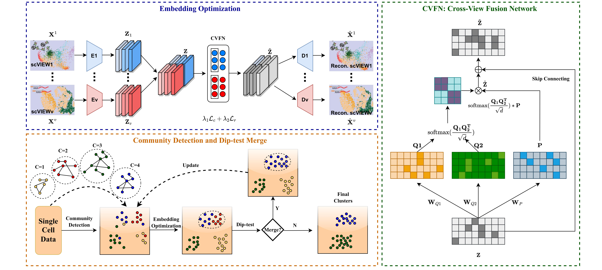

# scUNC: Single-cell Multi-view Clustering with Unknown Number of Clusters

[](https://www.python.org/)
[](https://pytorch.org/)
[](https://ieeexplore.ieee.org/xpl/RecentIssue.jsp?punumber=8857)

## 📖 Overview

**scUNC** is an innovative multi-view clustering approach tailored for single-cell data, designed to seamlessly integrate information from different views without the need for a predefined number of clusters.

Single-cell multi-view clustering enables the exploration of cellular heterogeneity. However, existing methods face two primary challenges:
1.  **Data Disparity:** They often treat scRNA and scATAC views as equally significant, overlooking the substantial disparity in data richness, which leads to performance degradation.
2.  **Predefined K:** Most methods require manual specification of the number of clusters ($K$). For biologists, precisely determining distinct cell types beforehand is a formidable challenge.

**scUNC** addresses these issues by leveraging a cross-view fusion network and a community detection-based mechanism to automatically determine the optimal number of clusters while effectively balancing multi-view information.

### Model Framework


> **Paper:** This work is published in *IEEE Transactions on Computational Biology and Bioinformatics (IEEE TCBB)*.

---

## 🛠 Requirements

Please ensure your environment meets the following dependencies:

* **Python** == 3.7.0
* **Torch** == 1.13.1
* **NumPy** == 1.21.6
* **Pandas** == 1.1.5
* **SciPy** == 1.7.3
* **Scikit-learn** == 0.22.2

### Installation
You can install the required Python packages using pip:

```bash
pip install torch==1.13.1 numpy==1.21.6 pandas==1.1.5 scipy==1.7.3 scikit-learn==0.22.2
````

-----

## 📂 Data Availability

Please refer to the `data/` directory for dataset organization. The framework supports standard single-cell multi-view datasets.

**Directory Structure Example:**

```text
data/
├── SMAGE-3K/
│   ├── ... (dataset files)
└── [Other_Datasets]/
```

-----

## 🚀 Usage

### 1\. Configuration

The model parameters, such as the target dataset and view dimensions, can be configured via command-line arguments in `run_scUNC.py`.

```python
# Example arguments in run_scUNC.py
parser.add_argument('--dataset', default='SMAGE-3K', help='Name of the dataset')
parser.add_argument("--view_dims", default=[dim1, dim2], help='Dimensions of input views')
parser.add_argument('--name', type=str, default='experiment_1', help='Name of the experiment')
# ... additional arguments ...
```

### 2\. Execution

To train the model and perform clustering (automatically determining $K$), simply run:

```bash
python run_scUNC.py
```

-----

## 📝 Citation

If you find **scUNC** useful for your research, please consider citing our paper:

**Text:**

> Hu, D., Guan, R., Dong, Z., Liang, K., Wang, J., Wang, S., & Liu, X. (2025). Single-cell Multi-view Clustering via Community Detection with Unknown Number of Clusters. *IEEE Transactions on Computational Biology and Bioinformatics*, 1-12.

**BibTeX:**

```bibtex
@article{scUNC,
  author={Hu, Dayu and Guan, Renxiang and Dong, Zhibin and Liang, Ke and Wang, Jun and Wang, Siwei and Liu, Xinwang},
  journal={IEEE Transactions on Computational Biology and Bioinformatics}, 
  title={Single-cell Multi-view Clustering via Community Detection with Unknown Number of Clusters}, 
  year={2025},
  volume={},
  number={},
  pages={1-12},
  doi={10.1109/TCBBIO.2025.3636975}
}
```

```
```
